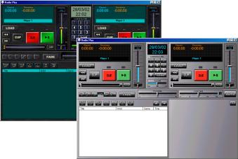



## MP3 Radio Plus

### Description

(Update 4/7) NOW with Soft Pitch, 2 Spectrum and 2 stereoVU for each player (Works in windos 9x/Me/NT/2K/XP). This is a professional MP3/WAV player for DJ's and Radios. 2 players, 1 sample player with 10 channels, various mix types, auto-crossfade, id3 editor, Skins. I replace the MEDIA PLAYER ActiveX (MSDXM.OCX) by DMC2 (Free ActiveX for Personal and Open Source! More information in author site: http://www.izzyonline.com/DMC2 ). Not Finished yet!. NEXT UPDATE: 12 Channels Equalizer. Sorry about my poor english, i'm brazilian
 
### More Info
 

             |
---                |---
**Submitted On**   |2002-04-07 23:37:12
**By**             |[Adriano Paladini](https://github.com/Planet-Source-Code/PSCIndex/blob/master/ByAuthor/adriano-paladini.md)
**Level**          |Beginner
**User Rating**    |4.9 (345 globes from 71 users)
**Compatibility**  |VB 5\.0, VB 6\.0
**Category**       |[Sound/MP3](https://github.com/Planet-Source-Code/PSCIndex/blob/master/ByCategory/sound-mp3__1-45.md)
**World**          |[Visual Basic](https://github.com/Planet-Source-Code/PSCIndex/blob/master/ByWorld/visual-basic.md)
**Archive File**   |[MP3\_Radio\_69924472002\.zip](https://github.com/Planet-Source-Code/adriano-paladini-mp3-radio-plus__1-33110/archive/master.zip)

